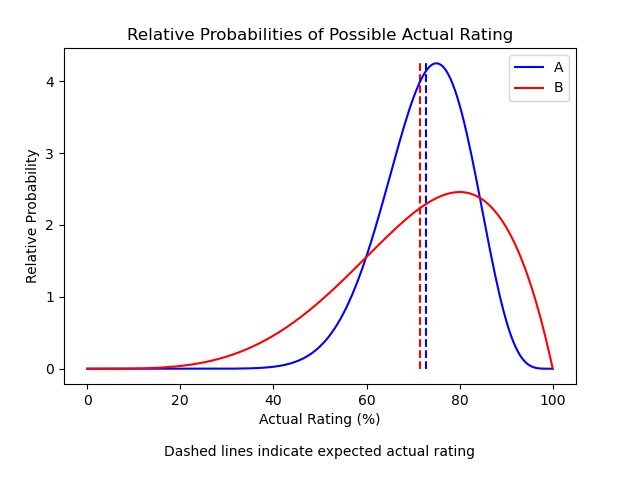

# Review-Comparison-Calculator  
Comparing product reviews with a custom web app

The website can be found here: http://reviewcomparisoncalculator.eu.pythonanywhere.com/  

The source code is available in this repository. The web app is built using the Flask framework.  

